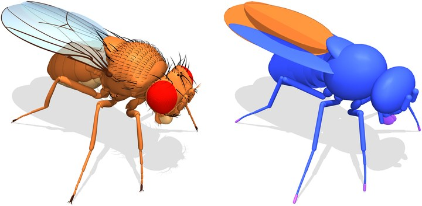

# flybody (Drosophila)

[Catalogo robot](README.md) · [Training compatibile con ArduPilot](training.md) · [README](../../README.it.md)



*flybody (Drosophila), render del modello (fly-white.png del repo): mesh anatomiche a sinistra, geometrie di collisione a destra. Foto: [github.com/TuragaLab/flybody](https://github.com/TuragaLab/flybody).*

| | |
|---|---|
| Id (cartella) | `flybody` |
| `NNM_ROBOT` | **13** |
| Classe | esapode |
| Progetto | Turaga Lab (HHMI Janelia) e Google DeepMind |
| Stato | manca una scena MuJoCo pronta per il training |
| Giunti comandati | 18 |
| Osservazione | 63 valori |
| Frequenza policy | 50 Hz |
| Attuatori | nessuno: 78 attuatori MuJoCo (56 di posizione sui giunti, kp 0,8 coxa/femore e 0,4 tibia/tarso in unità del modello; 8 sui tendini del tarso; 8 di adesione; 6 motori alari) |
| Collegamento | nessun hardware: modello di sola simulazione (SITL e HIL) |
| Licenza upstream | Apache-2.0 |

## Repo originale e file di base

- Repository: [github.com/TuragaLab/flybody](https://github.com/TuragaLab/flybody)
- Scena MuJoCo upstream: [`flybody/fruitfly/assets/floor.xml`](https://github.com/TuragaLab/flybody/blob/main/flybody/fruitfly/assets/floor.xml)
- CAD e parti stampabili: modello anatomico da micro-CT, mesh OBJ in flybody/fruitfly/assets (nessuna parte stampabile: non è un robot)
- BOM e montaggio: nessuna (modello biomeccanico); dati e checkpoint su figshare [doi.org/10.25378/janelia.25309105](https://doi.org/10.25378/janelia.25309105) (flybody/download_data.py)
- Training upstream: dm_control composer + Acme DMPO distribuito con Ray (flybody/train_dmpo_ray.py); task walk_imitation (inseguimento di traiettorie di mosche reali, 59 azioni, controllo 500 Hz, fisica 10 kHz), walk_on_ball, flight_imitation, vision_flight
- Policy upstream: checkpoint TensorFlow/Acme su figshare (chiave trained-policies di download_data.py): osservazione con posizione delle appendici, forze e contatti dei tarsi, riferimenti futuri; azioni con adesione; non convertibili

Per scaricare il repo originale e preparare la scena usata da simulazione e training:

```bash
.venv/bin/python tools/robots/fetch_upstream.py --robot flybody
```

Nota sul modello: floor.xml include fruitfly.xml e un pavimento a z = −0,132; il modello è in centimetri e grammi (gravità −981, massa 0,98 mg, passo fisico 0,1 ms, contatti solref 0,2 ms) mentre nnm_env.py lavora in SI a 200 Hz (passo 5 ms). Prima del training la scena va riscritta in metri con il pavimento a z = 0 e l'ambiente deve accettare un passo fisico più fine (fetch_upstream.py non lo fa ancora).

## Topologia

File: [`robots/flybody/robot/profile.json`](../../robots/flybody/robot/profile.json) → `robot.bin` sulla microSD. Ordine dei giunti = ordine di osservazione, azione e uscite servo.

| # | Giunto | q0 (rad) | Uscita servo |
|---:|---|---:|---|
| 0 | `coxa_T1_left` | +0.0000 | `SERVO1_FUNCTION 94` |
| 1 | `femur_T1_left` | +0.0000 | `SERVO2_FUNCTION 95` |
| 2 | `tibia_T1_left` | +0.0000 | `SERVO3_FUNCTION 96` |
| 3 | `coxa_T1_right` | +0.0000 | `SERVO4_FUNCTION 97` |
| 4 | `femur_T1_right` | +0.0000 | `SERVO5_FUNCTION 98` |
| 5 | `tibia_T1_right` | +0.0000 | `SERVO6_FUNCTION 99` |
| 6 | `coxa_T2_left` | +0.0000 | `SERVO7_FUNCTION 100` |
| 7 | `femur_T2_left` | +0.0000 | `SERVO8_FUNCTION 101` |
| 8 | `tibia_T2_left` | +0.0000 | `SERVO9_FUNCTION 102` |
| 9 | `coxa_T2_right` | +0.0000 | `SERVO10_FUNCTION 103` |
| 10 | `femur_T2_right` | +0.0000 | `SERVO11_FUNCTION 104` |
| 11 | `tibia_T2_right` | +0.0000 | `SERVO12_FUNCTION 105` |
| 12 | `coxa_T3_left` | +0.0000 | `SERVO13_FUNCTION 106` |
| 13 | `femur_T3_left` | +0.0000 | `SERVO14_FUNCTION 107` |
| 14 | `tibia_T3_left` | +0.0000 | `SERVO15_FUNCTION 108` |
| 15 | `coxa_T3_right` | +0.0000 | `SERVO16_FUNCTION 109` |
| 16 | `femur_T3_right` | +0.0000 | oltre Scripting16: serve il backend bus |
| 17 | `tibia_T3_right` | +0.0000 | oltre Scripting16: serve il backend bus |

Osservazione (63): gyro FLU 3, gravità FLU 3, q−q0 18, q̇ 18, azione precedente 18, twist vx vy ωz 3.
Azione (18): offset in radianti, `q_target = q0 + azione`.

## Modello meccanico e confronto con Petoi Bittle (OpenCat)

| Grandezza | flybody (Drosophila) | Petoi Bittle (OpenCat) | Fonte |
|---|---|---|---|
| Gradi di libertà per zampa | 7 (+ tendine tarso2 + adesione); 3 nel contratto: coxa, femore, tibia | 2: spalla, ginocchio | fruitfly.xml |
| Zampe / giunti comandati | 6 / 18 (42 disponibili) | 4 / 8 | fruitfly.xml, profilo |
| Lunghezza del corpo | ≈ 3,3 mm (estensione delle geometrie in x) | ≈ 20 cm | mj_forward in stand |
| Altezza del torace in stand | 1,26 mm | 47 mm | modello lasciato cadere con ctrl 0 |
| Massa | 0,98 mg (torace 0,34 mg) | 273,5 g | body_mass del modello |
| Attuatore nel MJCF | posizione kp 0,8 / 0,4, senza limite di coppia; giunti damping 0,01, rigidezza 0,01, armature 1e-6 | posizione kp 40, ±0,27 N·m | fruitfly.xml |
| Passo fisico / controllo upstream | 0,1 ms / 2 ms (500 Hz) | — | tasks/constants.py |
| Unità | cm, g, gravità −981 | SI | fruitfly.xml |
| IMU | gyro, accelerometer, velocimeter sul sito `thorax` | MPU6050 | fruitfly.xml |

## Architettura PPO

File: [`robots/flybody/robot/ppo.yaml`](../../robots/flybody/robot/ppo.yaml). Stessa rete di MicroDuck, già provata su Pixhawk 6C: **63 → 512 → 256 → 128 → 18**, ELU, normalizzazione dell'osservazione incorporata. Pesi int8 per riga addestrati sulla griglia int8 dalla prima iterazione (QAT), attivazioni float32. PPO: 2048 ambienti × 24 passi, 5 epoche, 4 minibatch, lr 1e-3 adattivo (KL 0,01), γ 0,99, λ 0,95, clip 0,2.

## Policy

Cartella: [`robots/flybody/policies/`](../../robots/flybody/policies/) → sulla microSD `/APM/nnm/flybody/policies/`. `NNM_POLICY` = indice del file in ordine alfabetico.

Nessuna policy ancora: va addestrata (sezione successiva).

## Training compatibile con ArduPilot

L'ambiente è già il deployment: fisica a 200 Hz come il loop dell'autopilota, gravità dal filtro IMU del firmware, azione tagliata a `NNM_ACT_MAX` e codificata in PWM, osservazione nell'ordine del profilo. Dettagli in [training.md](training.md).

```bash
.venv/bin/python tools/robots/nnm_env.py --robot flybody                       # carica la scena, passo a policy zero
.venv/bin/python tools/robots/train_velocity.py --robot flybody --envs 8 --iters 200 --name walk
.venv/bin/python tools/robots/train_velocity.py --robot flybody --eval robots/flybody/policies/walk.nnm
```

Il trainer CPU serve per verifiche e rifiniture brevi. Per una policy completa (2048 ambienti × 2000 iterazioni) si usa mjlab su GPU con gli stessi due pezzi: `deploy_contract.py` per osservazione e azione, `nnm_qat.enable_qat()` sull'actor, `export_nnm_from_actor()` per il file.

## Deploy sull'autopilota

```bash
python tools/robots/pack_robot_bin.py --robot flybody          # robot.bin dal profilo
# microSD: /APM/nnm/flybody/robot.bin  e  /APM/nnm/flybody/policies/*.nnm
```

Modello di sola simulazione: `robot.bin` e le policy si caricano in SITL e HIL (`NNM_ROBOT 13`, 18 giunti ≤ `NNM_MAX_JOINTS` 20); non c'è un robot da collegare.

## Note

- Primo esapode del catalogo e primo modello senza hardware: serve a provare il contratto NNMixer su una locomozione a sei zampe (tripode alternato L1+R2+L3 / R1+L2+R3) con un corpo anatomico.
- Contratto a 18 giunti: coxa, femore e tibia di ogni zampa, la tripla dei robot esapodi. Gli altri 24 giunti delle zampe (abduzione e torsione della coxa, torsione del femore, tarso) restano sui loro attuatori di posizione a comando zero, i tendini tarso2 e l'adesione delle unghie a zero, testa, bocca, antenne, addome fermi, ali retratte (springref). I 42 giunti completi superano `NNM_MAX_JOINTS` 20 e `NNM_MAX_OBS` 96 (osservazione 135): il firmware andrebbe allargato.
- q0 = 0: è la posa in piedi del modello (torace a 1,26 mm, tutte e sei le unghie a terra). La posa `springref` dei giunti delle zampe è quella retratta del volo.
- Scala e tempi: il modello è in cm/g con passo fisico 0,1 ms e controllo a 500 Hz; una mosca fa 10-15 passi al secondo, quindi a 50 Hz la policy ha 3-5 tick per passo. L'ambiente a contratto gira in SI a 200 Hz: prima del training vanno riscritti scena (metri, pavimento a z = 0) e passo fisico (sotto-passi a 0,1 ms dentro il tick da 5 ms). Verifica: `nnm_env.py --robot flybody` carica la scena upstream (giunti, attuatori, sensori IMU e unghie risolti, osservazione 63) ma con il passo a 5 ms la fisica diverge dopo 40 ms.
- L'adesione delle unghie (6 attuatori 0-1, nel task upstream fa parte dell'azione) non è nel contratto NNMixer, che manda solo posizioni: da verificare in simulazione se il passo in piano regge senza, altrimenti serve un canale d'azione dedicato. Le zampe nel tripode alternato (L1+R2+L3, R1+L2+R3) non hanno ancora un termine di reward: `trot_pairs` dell'ambiente è a due coppie.
- I termini di reward dell'ambiente sono in SI (altezze in metri, velocità in m/s): comandi 1-3 cm/s, altezza del tronco 1,3 mm, sollevamento del piede sotto il millimetro; le deviazioni standard dei kernel vanno riscalate di conseguenza in `reward` prima del primo run.
- Le policy pubblicate (DMPO, Acme) vedono posizione delle appendici, forze e contatti dei tarsi e i riferimenti futuri della traiettoria: non convertibili, la policy va addestrata sul contratto.
- Licenza Apache-2.0; citare Vaxenburg et al., Nature 643, 1312-1320 (2025).
