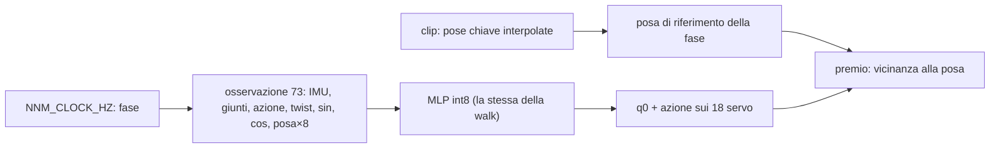
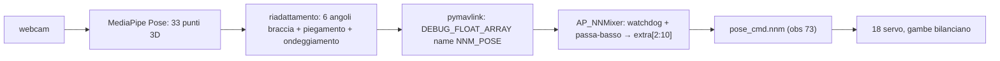

# Gesti per imitazione di clip: saluto e balletto

[Catalogo robot](README.md) · [Training compatibile con ArduPilot](training.md) · [Microban](microban.md)

Oltre alla camminata, un robot del catalogo può imparare un **gesto a tempo**: un saluto, un balletto,
una posa. Questa pagina spiega come funziona l'algoritmo, perché il primo approccio non funzionava, e come
si aggiunge un gesto nuovo. Il banco di prova è Microban (braccia a 3 gradi di libertà, gambe a 6).

Risultati: [`wave_right.nnm`](../../robots/microban/policies/wave_right.nnm) saluta con la destra
([video](../media/microban_wave_right_clip_it0300.mp4)), [`dance.nnm`](../../robots/microban/policies/dance.nnm)
balla con braccia e gambe ([video](../media/microban_dance_it0400.mp4)). In verde, nei video, il corpo di
riferimento della clip in quell'istante.

## L'idea in breve

La camminata insegue una **velocità**: la rete riceve `(vx, vy, wz)` e viene premiata se il tronco si muove
a quella velocità. Un gesto insegue invece una **posa che cambia nel tempo**. Il metodo è quello che i
robot umanoidi come l'Unitree G1 usano per ballo e arti marziali (DeepMimic, PBHC), ridotto ai giunti di un
robot da 350 g:

1. **Una clip di riferimento**: poche pose chiave dei giunti su un periodo, interpolate con un coseno. Per il
   saluto sono tre numeri per la spalla e il gomito; per il balletto sedici giunti su diciotto.
2. **Un orologio nell'osservazione**: seno e coseno di una fase che avanza a frequenza fissa. Sono i due
   canali extra dopo il twist, gli stessi che MicroDuck usa per la posa della testa. Il firmware li genera
   con il parametro `NNM_CLOCK_HZ`.
3. **Un premio denso**: a ogni passo, quanto i giunti della clip sono vicini alla posa di *questa* fase. Un
   termine lineare nell'errore, che dà gradiente anche a un braccio abbassato, e un termine `exp(-err²)` più
   stretto che paga il seguire la clip da vicino.

La rete resta la stessa MLP a un solo forward per tick che il firmware esegue oggi: cambia solo cosa vede
(due numeri in più) e cosa viene premiato. Le gambe non nominate nella clip restano sulla posa in piedi, con
i termini di equilibrio della camminata.



## Perché il metodo precedente non funzionava

Il primo saluto era descritto con un reward scritto a mano, senza orologio: "porta il gomito a −1,35, poi
a −0,35, poi di nuovo", e successivamente "resta in una fascia e muoviti a 1 rad/s". I tre tentativi sono
nei video della [pagina Microban](microban.md#risultati-per-versione-di-ambiente-ed-epoca), e falliscono
per la stessa ragione.

| Tentativo | Cosa premiava | Cosa ha imparato |
|---|---|---|
| bersaglio alternato | il gomito verso un estremo, poi l'altro | braccio fermo: il premio era già a zero a braccio abbassato, nessun gradiente |
| fascia + velocità del gomito | stare in una fascia e muoversi | 38 inversioni in 8 s, uno scuotimento veloce |
| fascia + velocità lenta + arco | coprire tutta la fascia in 1,2 s | un solo arco, poi fermo: 7 punti su 8 di premio venivano dalla posa |

La rete che gira sul Pixhawk **non ha memoria**: vede IMU, giunti e azione precedente. Un'oscillazione
richiede di sapere in che punto del ciclo ci si trova, e questa informazione non era in nessun ingresso.
La rete doveva scoprire da sola una regola del tipo "se stai salendo continua fino in cima, poi torna",
esplorando con rumore piccolo per non cadere, e con un premio che arrivava solo dopo un ciclo intero. Non
ci è arrivata, e ha preso i punti facili della posa.

Con l'orologio il problema cambia natura. La posa da raggiungere è una funzione dell'ingresso, il premio è
immediato e non ambiguo, e la rete impara una mappa "fase → angoli" con le correzioni di equilibrio. Il
saluto è arrivato in 300 iterazioni, il balletto delle braccia in 200 e quello a corpo intero in 400.

## Vantaggi rispetto al reward scritto a mano

- **Si descrive il movimento, non la regola per ottenerlo.** Un gesto nuovo sono pose chiave in
  [`nnm_env.py`](../../tools/robots/nnm_env.py) (`_setup_gesture`), nessun termine di reward da inventare.
- **Converge in fretta e in modo prevedibile.** L'errore rispetto alla clip è misurabile a ogni checkpoint
  (0,01 rad sul saluto, 0,00–0,05 sul balletto), e il video mostra riferimento e robot sovrapposti.
- **Le policy si accumulano.** Ogni gesto è un `.nnm` nella cartella del robot, scelto con `NNM_POLICY`.
  Il balletto è partito dal checkpoint del saluto, che già sapeva leggere l'orologio.
- **La camminata non cambia.** I gesti nascono da `walk_md` e ne conservano l'equilibrio; le walk esistenti
  sono state allargate a 65 ingressi con colonne a zero e hanno uscita identica al bit.
- **È la strada per le clip da video.** La pipeline del G1 (video → stima della posa umana → riadattamento
  ai giunti del robot) produce esattamente pose chiave nel tempo: entra qui senza cambiare il training.

Costo: due numeri in più nell'osservazione, un seno e un coseno per tick, circa mille pesi int8 in più nel
primo strato su duecentomila. Sotto l'1% del tempo di inferenza.

## Le clip attuali (Microban)

| Clip | Frequenza | Giunti | Descrizione |
|---|---:|---:|---|
| `wave_right` | 0,5 Hz | 3 | mano destra alta (pitch −1,10, gomito −1,00); il roll della spalla porta la mano in fuori (−0,25 → −1,05) e la riporta |
| `dance_arms` | 0,625 Hz | 6 | le braccia pompano in alternanza: una sale e si apre mentre l'altra scende e si chiude |
| `dance` | 0,625 Hz | 16 | `dance_arms` più molleggio sulle ginocchia due volte per ciclo (0,15 → 0,55 rad, anca −0,24 e caviglia −0,28 per mezzo radiante, piede piatto) e ondeggiamento laterale una volta per ciclo (anca +δ, caviglia −δ su entrambe le gambe, ±0,12 rad, bacino ±1,2 cm) |
| `arms_up` | statica | 4 | entrambe le braccia alzate |

Gli angoli delle gambe sono stati misurati sul modello MJCF cercando, per ogni piegamento del ginocchio,
l'anca e la caviglia che tengono il piede piatto e sotto il bacino. Il segno di ogni giunto è stato
verificato con la cinematica diretta prima di scrivere la clip.

## Come si addestra un gesto

```bash
# saluto: rifinitura della camminata, orologio a 0,5 Hz nella clip
.venv/bin/python tools/robots/train_velocity.py --robot microban --gesture wave_right \
    --init-nnm robots/microban/policies/walk_md.nnm --init-std 0.3 --lr 2e-4 \
    --envs 512 --workers 8 --iters 600 --save-every 100 --eval-every 100 --name wave_right

# balletto a corpo intero, partendo dal checkpoint del saluto
.venv/bin/python tools/robots/train_velocity.py --robot microban --gesture dance \
    --resume robots/microban/policies/wave_right_run/wave_right_it0300.pt --start-iter 0 --lr 2e-4 \
    --envs 512 --workers 8 --iters 800 --save-every 100 --eval-every 100 --name dance

# video con il corpo di riferimento in verde
.venv/bin/python tools/robots/play_policy.py --robot microban --nnm robots/microban/policies/dance.nnm \
    --gesture dance --stand 8 --video docs/media/microban_dance.mp4
```

Con `--gesture` il trainer tiene il comando di velocità a zero, spegne le spinte casuali, abbassa
`action_rate` a −0,02 (un radiante di braccio non va lisciato via), fissa il learning rate e mette
l'esplorazione a 0,30 sui giunti delle braccia nominati dalla clip, 0,12 su quelli delle gambe, 0,06 sul
resto. La fase iniziale di ogni episodio è casuale: la rete impara ad agganciare la clip in qualunque
punto, come succede sul robot quando si cambia policy.

## Aggiungere un gesto nuovo

1. In [`nnm_env.py`](../../tools/robots/nnm_env.py), `_setup_gesture`, aggiungere una voce a `presets`:
   `hz` (0 per una posa statica) e `keys`, un elenco `(fase, angolo)` per giunto. La clip è periodica e la
   fase va da 0 a 1.
2. Verificare i segni con la cinematica del modello (`mujoco.mj_forward` sulla posa) prima di fidarsi degli
   angoli: su Microban il pitch negativo alza la mano, il roll destro si apre per angoli negativi, il
   sinistro per angoli positivi.
3. Aggiungere il nome alle scelte di `--gesture` in `train_velocity.py` e lanciare come sopra.
4. Il file `.nnm` va in `robots/<robot>/policies/`; sul robot si seleziona con `NNM_POLICY` e si imposta
   `NNM_CLOCK_HZ` alla frequenza della clip.

Per un robot che oggi ha `extra_cmd_dim 0`, portarlo a 2 in [`catalog.py`](../../tools/robots/catalog.py),
rigenerare con `build_catalog.py` e allargare le policy esistenti con
[`pad_nnm_obs.py`](../../tools/robots/pad_nnm_obs.py): le colonne aggiunte hanno peso zero e l'uscita
non cambia.

## Deploy

| Parametro | Camminata | Saluto | Balletto | Teleop posa |
|---|---|---|---|---|
| `NNM_POLICY` | indice di `walk_md.nnm` | indice di `wave_right.nnm` | indice di `dance.nnm` | indice di `pose_cmd.nnm` |
| `NNM_CLOCK_HZ` | 0 | 0,5 | 0,625 | 0 |
| `NNM_POSE_WD` | — | — | — | 500 ms (watchdog stream) |
| `NNM_POSE_TAU` | — | — | — | 0,15 s (passa-basso) |

Il firmware fa avanzare la fase di `2π · NNM_CLOCK_HZ / rate_hz` a ogni tick della policy e scrive seno e
coseno nei due canali dopo il twist. A `NNM_CLOCK_HZ 0` i canali restano a zero, che è quello su cui le
walk sono state addestrate. Il cambio di policy usa il cross-fade di `NNM_BLEND_MS` come oggi.

## Teleoperazione: posa in ingresso via MAVLink

Oltre alle clip a orologio, Microban può eseguire una **posa comandata in tempo reale**. Una ground station
stima la posa di una persona, la riadatta a otto numeri e li manda al firmware; la policy
[`pose_cmd.nnm`](../../robots/microban/policies/pose_cmd.nnm) li esegue tenendo l'equilibrio.

### Flusso



Tutta l'intelligenza (stima, riadattamento, limiti) sta sulla GCS. Il firmware copia i numeri
nell'osservazione dopo l'orologio; se lo stream smette (`NNM_POSE_WD`), i canali decadono a zero con lo
stesso filtro e il robot torna in posa di riposo senza scatti.

### Layout dei canali (dopo sin, cos)

| idx | canale | unità / range |
|---|---|---|
| 0–2 | `right_shoulder_pitch/roll/elbow` | rad, offset da `q0` |
| 3–5 | `left_shoulder_pitch/roll/elbow` | rad, offset da `q0` |
| 6 | `knee_bend` | rad, 0…0,55 → ginocchio +k, anca −0,48k, caviglia −0,56k |
| 7 | `sway` | rad, ±0,15 → anche +d, caviglie −d |

### Ground station

```bash
# dipendenze: mediapipe, opencv-python (in requirements.txt)
.venv/bin/python tools/mocap/mocap_gcs.py --source camera --conn udp:127.0.0.1:14550
.venv/bin/python tools/mocap/mocap_gcs.py --source clip --clip wave_right   # prova senza webcam
.venv/bin/python tools/mocap/mocap_gcs.py --source keyboard
```

Con `--source camera`, `c` calibra la posa in piedi (baseline del piegamento), `0` manda la posa di
riposo, `q` esce. Opzione `--mirror` scambia destra/sinistra.

### Simulazione pura (senza firmware)

```bash
# terminale A: ascolta NNM_POSE e guida la policy in MuJoCo (verde = corpo comandato)
.venv/bin/python tools/robots/play_policy.py --robot microban \
    --nnm robots/microban/policies/pose_cmd.nnm \
    --pose-mavlink udp:127.0.0.1:14550 --stand 60 \
    --video docs/media/microban_pose_cmd_mavlink_wave.mp4

# terminale B: stream della clip (o della webcam). Senza firmware nessuno parla per primo alla GCS,
# quindi qui serve `udpout:` (destinazione esplicita); verso SITL/MAVProxy basta `udp:127.0.0.1:14550`
.venv/bin/python tools/mocap/mocap_gcs.py --source clip --clip wave_right --conn udpout:127.0.0.1:14550
```

Sul firmware la ricezione si vede dal `NAMED_VALUE_FLOAT` `PPO_POSE0` (primo canale filtrato): segue lo
stream e, a GCS spenta, torna a zero in `NNM_POSE_WD` + qualche `NNM_POSE_TAU`.

### Training

```bash
.venv/bin/python tools/robots/train_velocity.py --robot microban --gesture pose_cmd \
    --resume robots/microban/policies/dance_run/dance_it0400.pt \
    --envs 512 --workers 8 --iters 2000 --save-every 200 --name pose_cmd --lr 2e-4
```

Il trainer allarga automaticamente un checkpoint `.pt` da 65 a 73 ingressi (stessa logica di
`pad_nnm_obs`). L'ambiente campiona pose casuali, episodi a comando zero e il 20 % di stream dalle clip
`wave_right`/`dance`, con ritardo 0–3 tick e passa-basso 0,15 s come il firmware.

Cosa è successo nei run (`pose_cmd_v1_run`, `pose_cmd_v2_run`, `pose_cmd_run`):

- **v1** (800 iter): il premio `base_height` chiedeva 4 cm di abbassamento a piegamento pieno, ma la
  cinematica con piede piatto ne dà 0,8: il robot si accovacciava contro la posa di riferimento e le
  ginocchia restavano piegate anche a comando zero. Errore a it800: 0,10 rad. La std di esplorazione
  saliva da 0,17 a 0,37.
- **v2** (800 iter, `--std-cap`): std bloccata a 0,17 e `base_height` corretto, ma a it800 l'errore era
  0,18 rad: l'esplorazione libera del v1 era utile, non un difetto. Il tappo resta disponibile ma è
  disattivato di default.
- **v3** (= `pose_cmd_run`, 800→2000 da v1 it800 con `--keep-std` e `base_height` corretto): 0,048 rad a
  it1200, 0,030 a it1800. Il selettore "best" del trainer usa il punteggio stand/walk, che qui non
  misura nulla: `pose_cmd.nnm` è il checkpoint 1800 scelto sul tracking delle pose.

Misure con `pose_cmd.nnm`: cinque pose tenute 3 s (riposo, braccia, piegamento 0,45, ondeggiamento
0,12, posa completa) errore medio 0,026–0,038 rad; saluto in streaming MAVLink a 40 Hz 0,043 rad sulle
braccia; watchdog firmware su SITL: a stream fermo il canale passa da −1,0 a −0,02 in 0,95 s
(500 ms di attesa + costante 0,15 s), zero cadute.

## Limiti

- La clip è periodica: un gesto "una volta sola" (un inchino) si ottiene fermando l'orologio a fine ciclo,
  che il firmware oggi non fa.
- Le gambe nella clip restano piccoli spostamenti a piedi fermi. Passi, salti o giri richiedono il tracking
  anche della posa del tronco, come nei lavori sul G1, e un premio che tolleri il contatto che cambia.
- Le pose chiave delle clip sono scritte a mano; la teleoperazione via MediaPipe le sostituisce in tempo
  reale, ma resta un riadattamento cinematico semplificato (non un IK a corpo intero).
