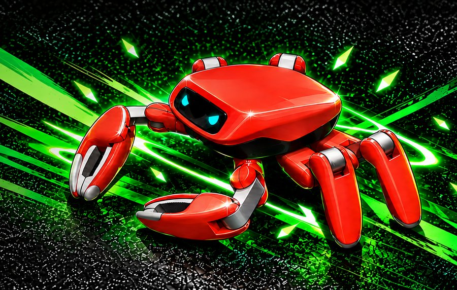

# Jumper

[Catalogo robot](README.md) · [Training compatibile con ArduPilot](training.md) · [README](../../README.it.md)



*Jumper, render di prodotto, ritaglio di docs/media/jumper-hero.png. Foto: [github.com/KingKongRobotics/jumper](https://github.com/KingKongRobotics/jumper).*

| | |
|---|---|
| Id (cartella) | `jumper` |
| `NNM_ROBOT` | **17** |
| Classe | esapode |
| Progetto | KingKong Robotics |
| Stato | manca una scena MuJoCo pronta per il training |
| Giunti comandati | 20 |
| Osservazione | 69 valori |
| Frequenza policy | 50 Hz |
| Attuatori | 22 servo tattili proprietari, tutti lo stesso 50:1 (plateau 1,7464 N·m fino a 293 rpm, zero coppia oltre 611 rpm; in sim kp 10 / kd 0,5). Il computer di bordo è un RK3576, non un autopilota; il protocollo del bus non è nel repo |
| Collegamento | servo su bus seriale: serve il backend bus nel firmware (non ancora scritto) |
| Licenza upstream | Apache-2.0 (codice e modello); i materiali di terze parti restano sotto la propria licenza |

## Repo originale e file di base

- Repository: [github.com/KingKongRobotics/jumper](https://github.com/KingKongRobotics/jumper)
- Scena MuJoCo upstream: [`assets/jumper/jumper.xml`](https://github.com/KingKongRobotics/jumper/blob/main/assets/jumper/jumper.xml)
- CAD e parti stampabili: URDF in assets/jumper/urdf/jumper/urdf/jumper.urdf e STL visivi in assets/jumper/urdf/jumper/meshes/visual; skin e scene in [github.com/KingKongRobotics/jumper-design](https://github.com/KingKongRobotics/jumper-design)
- BOM e montaggio: docs/HARDWARE.md: 400×400×200 mm, 1,8 kg (prototipo 2,8 kg; il MJCF somma 2,54 kg), 22 servo tattili, Rockchip RK3576 (8 core, NPU 6 TOPS, 4 GB), IMU 6 assi, dToF 54×42, camera 5 MP, batteria Li-ion 25,2 V 3000 mAh. Scheda prodotto: [kingkong.tech/jumper](https://kingkong.tech/jumper)
- Training upstream: mjlab + rsl_rl + MuJoCo Warp (scripts/train.py). Cammino: jumper.tripod, flat, ripple, tetrapod, fisica 5 ms e decimazione 4 (50 Hz), azione = 0,25 × uscita sommata a HOME, orologio di fase a 3,125 Hz spento da fermo, osservazione 411 (storia di 5 frame) → 20. Altri task: jump a 200 Hz, posture, dance, gesti, five_foot (le chele afferrano). Export ONNX e bundle .app per RKNN sul robot
- Policy upstream: nessun checkpoint nel repo: l'attore esportato è 411 → 20 con storia e orologio di fase, non il contratto NNMixer a frame singolo; non convertibile

Per scaricare il repo originale e preparare la scena usata da simulazione e training:

```bash
.venv/bin/python tools/robots/fetch_upstream.py --robot jumper
```

Nota sul modello: il MJCF ha i 22 giunti, il giunto libero floating_base, l'IMU sul site imu (gyro imu_ang_vel, accelerometro imu_lin_acc) e i sei siti dei piedi, ma nessun blocco actuator: mjlab aggiunge il ServoCurveActuator a runtime (kp 10, kd 0,5, coppia sulla curva misurata, plateau 1,7464 N·m). nnm_env.py rifiuta un giunto senza attuatore, quindi la scena non è ancora eseguibile: vanno aggiunti 22 motori (i due gripper tenuti a 0) prima del training.

## Topologia

File: [`robots/jumper/robot/profile.json`](../../robots/jumper/robot/profile.json) → `robot.bin` sulla microSD. Ordine dei giunti = ordine di osservazione, azione e uscite servo.

| # | Giunto | q0 (rad) | Uscita servo |
|---:|---|---:|---|
| 0 | `LF_J0_joint` | -0.5507 | `SERVO1_FUNCTION 94` |
| 1 | `LF_J1_joint` | -1.0658 | `SERVO2_FUNCTION 95` |
| 2 | `LF_J2_joint` | -0.4408 | `SERVO3_FUNCTION 96` |
| 3 | `LF_J3_joint` | -1.3740 | `SERVO4_FUNCTION 97` |
| 4 | `RF_J0_joint` | +0.5524 | `SERVO5_FUNCTION 98` |
| 5 | `RF_J1_joint` | -1.0660 | `SERVO6_FUNCTION 99` |
| 6 | `RF_J2_joint` | +0.4414 | `SERVO7_FUNCTION 100` |
| 7 | `RF_J3_joint` | +1.4173 | `SERVO8_FUNCTION 101` |
| 8 | `LM_J0_joint` | +0.0012 | `SERVO9_FUNCTION 102` |
| 9 | `LM_J1_joint` | +0.5356 | `SERVO10_FUNCTION 103` |
| 10 | `LM_J2_joint` | -1.8271 | `SERVO11_FUNCTION 104` |
| 11 | `RM_J0_joint` | -0.0012 | `SERVO12_FUNCTION 105` |
| 12 | `RM_J1_joint` | -0.5376 | `SERVO13_FUNCTION 106` |
| 13 | `RM_J2_joint` | +1.8313 | `SERVO14_FUNCTION 107` |
| 14 | `LR_J0_joint` | +0.6313 | `SERVO15_FUNCTION 108` |
| 15 | `LR_J1_joint` | +0.5534 | `SERVO16_FUNCTION 109` |
| 16 | `LR_J2_joint` | -1.8648 | oltre Scripting16: serve il backend bus |
| 17 | `RR_J0_joint` | -0.6326 | oltre Scripting16: serve il backend bus |
| 18 | `RR_J1_joint` | -0.5548 | oltre Scripting16: serve il backend bus |
| 19 | `RR_J2_joint` | +1.8678 | oltre Scripting16: serve il backend bus |

Osservazione (69): gyro FLU 3, gravità FLU 3, q−q0 20, q̇ 20, azione precedente 20, twist vx vy ωz 3.
Azione (20): offset in radianti, `q_target = q0 + azione`.

## Architettura PPO

File: [`robots/jumper/robot/ppo.yaml`](../../robots/jumper/robot/ppo.yaml). Stessa rete di MicroDuck, già provata su Pixhawk 6C: **69 → 512 → 256 → 128 → 20**, ELU, normalizzazione dell'osservazione incorporata. Pesi int8 per riga addestrati sulla griglia int8 dalla prima iterazione (QAT), attivazioni float32. PPO: 2048 ambienti × 24 passi, 5 epoche, 4 minibatch, lr 1e-3 adattivo (KL 0,01), γ 0,99, λ 0,95, clip 0,2.

## Policy

Cartella: [`robots/jumper/policies/`](../../robots/jumper/policies/) → sulla microSD `/APM/nnm/jumper/policies/`. `NNM_POLICY` = indice del file in ordine alfabetico.

Nessuna policy ancora: va addestrata (sezione successiva).

## Training compatibile con ArduPilot

L'ambiente è già il deployment: fisica a 200 Hz come il loop dell'autopilota, gravità dal filtro IMU del firmware, azione tagliata a `NNM_ACT_MAX` e codificata in PWM, osservazione nell'ordine del profilo. Dettagli in [training.md](training.md).

```bash
.venv/bin/python tools/robots/nnm_env.py --robot jumper                       # carica la scena, passo a policy zero
.venv/bin/python tools/robots/train_velocity.py --robot jumper --envs 8 --iters 200 --name walk
.venv/bin/python tools/robots/train_velocity.py --robot jumper --eval robots/jumper/policies/walk.nnm
```

Il trainer CPU serve per verifiche e rifiniture brevi. Per una policy completa (2048 ambienti × 2000 iterazioni) si usa mjlab su GPU con gli stessi due pezzi: `deploy_contract.py` per osservazione e azione, `nnm_qat.enable_qat()` sull'actor, `export_nnm_from_actor()` per il file.

## Deploy sull'autopilota

```bash
python tools/robots/pack_robot_bin.py --robot jumper          # robot.bin dal profilo
# microSD: /APM/nnm/jumper/robot.bin  e  /APM/nnm/jumper/policies/*.nnm
```

Con 20 giunti il firmware carica `robot.bin` e le policy (fino a 20 giunti, `NNM_MAX_JOINTS`) e gira in SITL, ma le uscite PWM coprono al massimo 16 funzioni servo Scripting: il deploy sul robot richiede il backend bus. Simulazione, training e file `.nnm` sono già pronti.

## Note

- Il contratto prende i 20 giunti di `GAIT_JOINTS`, l'ordine di `HOME` senza le due chele (`LF_J4_joint`, `RF_J4_joint`), che upstream tiene a 0 con il PD e che la policy di cammino non comanda. 20 = `NNM_MAX_JOINTS`, osservazione 69: SITL e HIL ci stanno, le 16 funzioni servo Scripting no.
- I nomi sono quelli del MJCF. Davanti, J0..J3 sono yaw di spalla, pitch di spalla, gomito e polso; sulle quattro zampe, J0..J2 sono yaw d'anca, flessione e ginocchio. Destra e sinistra sono specchiate: lo stesso indice non ha lo stesso segno (ginocchio sinistro negativo, destro positivo).
- q0 è la posa `HOME` di `constants.py`, quella in cui i sei appoggi sono complanari e il corpo sta a 0,10647 m. Non è la posa a giunti zero.
- Il file `jumper.xml` non ha attuatori: la coppia la mette mjlab a ogni step, sulla curva misurata del servo. Prima di `nnm_env.py` vanno aggiunti i motori (e i due gripper tenuti a home, come per le braccia di ToddlerBot).
- L'osservazione upstream da 411 valori, con 5 frame di storia e l'orologio di fase, non si converte in .nnm. Si riaddestra sul contratto. L'orologio spento da fermo è lo stesso schema già usato per Booster (`NNM_CLOCK_HZ`).
- Il repo allena anche salto, danza, gesti e presa con le chele. Sono fuori dal contratto di velocità; il salto in particolare gira a 200 Hz su un moto di riferimento, non a 50 Hz.
