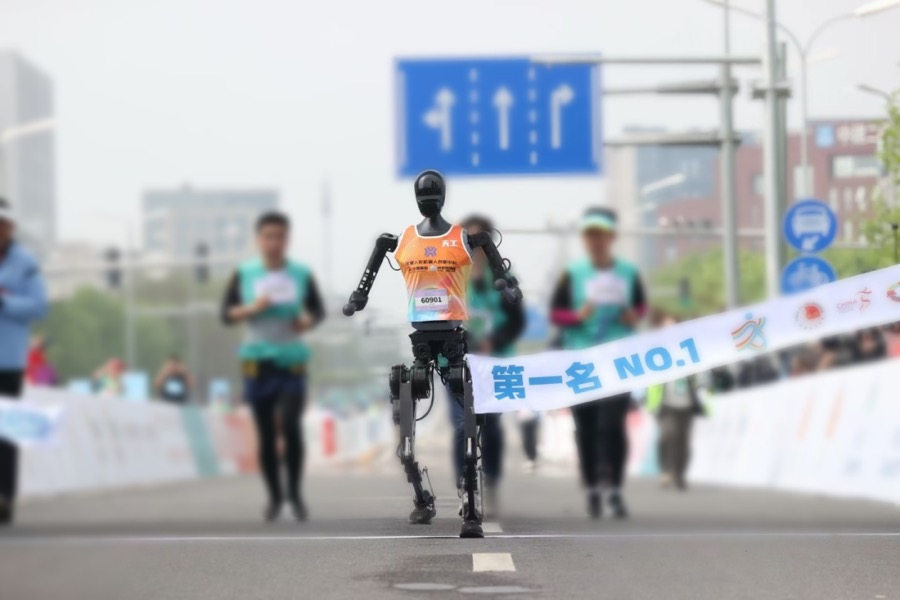

# TienKung (Walker)

[Catalogo robot](README.md) · [Training compatibile con ArduPilot](training.md) · [README](../../README.it.md)



*TienKung (Walker), il robot al traguardo di una maratona (docs/Tienkung_marathon.jpg del repo). Foto: [github.com/UBTECH-Robot/TienKung-Lab](https://github.com/UBTECH-Robot/TienKung-Lab).*

| | |
|---|---|
| Id (cartella) | `tienkung` |
| `NNM_ROBOT` | **15** |
| Classe | bipede |
| Progetto | UBTECH e Beijing Humanoid Robot Innovation Center |
| Stato | manca una scena MuJoCo pronta per il training |
| Giunti comandati | 20 |
| Osservazione | 69 valori |
| Frequenza policy | 50 Hz |
| Attuatori | attuatori proprietari del Walker TienKung (nel lab: kp 700 / kd 10 su anche e ginocchia, kp 500 / kd 5 sullo yaw d'anca; caviglie kp più bassi, coppia 60 e 30 N·m) |
| Collegamento | servo su bus seriale: serve il backend bus nel firmware (non ancora scritto) |
| Licenza upstream | BSD-3-Clause (codice TienKung-Lab); URDF e mesh STL sotto OpenAtom Open Hardware License 1.0 in https://github.com/Open-X-Humanoid/TienKung_URDF |

## Repo originale e file di base

- Repository: [github.com/UBTECH-Robot/TienKung-Lab](https://github.com/UBTECH-Robot/TienKung-Lab)
- Scena MuJoCo upstream: [`legged_lab/assets/tienkung2_lite/mjcf/tienkung.xml`](https://github.com/UBTECH-Robot/TienKung-Lab/blob/main/legged_lab/assets/tienkung2_lite/mjcf/tienkung.xml)
- CAD e parti stampabili: URDF, STL e STEP (lite, pro, con mani) in Open-X-Humanoid/TienKung_URDF
- BOM e montaggio: robot commerciale Walker TienKung; attuatori nel lab: anche/ginocchio fino a 300 N·m, caviglie 60/30 N·m (ImplicitActuatorCfg di tienkung.py)
- Training upstream: Isaac Sim 4.5 + Isaac Lab 2.1, rsl_rl AMP-PPO, 4096 env, fisica 5 ms e decimazione 4 (policy a 50 Hz), storia di osservazione dell'attore lunga 10; task walk e run, retarget SMPL-X (AMASS, OMOMO) via GMR; sim2sim legged_lab/scripts/sim2sim.py, sim2real in UBTECH-Robot/Deploy_Tienkung
- Policy upstream: Exported_policy/walk.pt (e run.pt): rete con 10 frame di storia, non il contratto NNMixer a frame singolo; non convertibile

Per scaricare il repo originale e preparare la scena usata da simulazione e training:

```bash
.venv/bin/python tools/robots/fetch_upstream.py --robot tienkung
```

Nota sul modello: il MJCF è nel repo (gravità SI, integrator implicitfast, mesh STL in ../meshes): va copiato con le mesh in robots/tienkung/robot/scene.xml. fetch_upstream.py non conosce ancora questo repo.

## Topologia

File: [`robots/tienkung/robot/profile.json`](../../robots/tienkung/robot/profile.json) → `robot.bin` sulla microSD. Ordine dei giunti = ordine di osservazione, azione e uscite servo.

| # | Giunto | q0 (rad) | Uscita servo |
|---:|---|---:|---|
| 0 | `hip_roll_l` | +0.0000 | `SERVO1_FUNCTION 94` |
| 1 | `hip_pitch_l` | -0.5000 | `SERVO2_FUNCTION 95` |
| 2 | `hip_yaw_l` | +0.0000 | `SERVO3_FUNCTION 96` |
| 3 | `knee_pitch_l` | +1.0000 | `SERVO4_FUNCTION 97` |
| 4 | `ankle_pitch_l` | -0.5000 | `SERVO5_FUNCTION 98` |
| 5 | `ankle_roll_l` | +0.0000 | `SERVO6_FUNCTION 99` |
| 6 | `hip_roll_r` | +0.0000 | `SERVO7_FUNCTION 100` |
| 7 | `hip_pitch_r` | -0.5000 | `SERVO8_FUNCTION 101` |
| 8 | `hip_yaw_r` | +0.0000 | `SERVO9_FUNCTION 102` |
| 9 | `knee_pitch_r` | +1.0000 | `SERVO10_FUNCTION 103` |
| 10 | `ankle_pitch_r` | -0.5000 | `SERVO11_FUNCTION 104` |
| 11 | `ankle_roll_r` | +0.0000 | `SERVO12_FUNCTION 105` |
| 12 | `shoulder_pitch_l` | +0.0000 | `SERVO13_FUNCTION 106` |
| 13 | `shoulder_roll_l` | +0.1000 | `SERVO14_FUNCTION 107` |
| 14 | `shoulder_yaw_l` | +0.0000 | `SERVO15_FUNCTION 108` |
| 15 | `elbow_pitch_l` | -0.3000 | `SERVO16_FUNCTION 109` |
| 16 | `shoulder_pitch_r` | +0.0000 | oltre Scripting16: serve il backend bus |
| 17 | `shoulder_roll_r` | -0.1000 | oltre Scripting16: serve il backend bus |
| 18 | `shoulder_yaw_r` | +0.0000 | oltre Scripting16: serve il backend bus |
| 19 | `elbow_pitch_r` | -0.3000 | oltre Scripting16: serve il backend bus |

Osservazione (69): gyro FLU 3, gravità FLU 3, q−q0 20, q̇ 20, azione precedente 20, twist vx vy ωz 3.
Azione (20): offset in radianti, `q_target = q0 + azione`.

## Architettura PPO

File: [`robots/tienkung/robot/ppo.yaml`](../../robots/tienkung/robot/ppo.yaml). Stessa rete di MicroDuck, già provata su Pixhawk 6C: **69 → 512 → 256 → 128 → 20**, ELU, normalizzazione dell'osservazione incorporata. Pesi int8 per riga addestrati sulla griglia int8 dalla prima iterazione (QAT), attivazioni float32. PPO: 2048 ambienti × 24 passi, 5 epoche, 4 minibatch, lr 1e-3 adattivo (KL 0,01), γ 0,99, λ 0,95, clip 0,2.

## Policy

Cartella: [`robots/tienkung/policies/`](../../robots/tienkung/policies/) → sulla microSD `/APM/nnm/tienkung/policies/`. `NNM_POLICY` = indice del file in ordine alfabetico.

Nessuna policy ancora: va addestrata (sezione successiva).

## Training compatibile con ArduPilot

L'ambiente è già il deployment: fisica a 200 Hz come il loop dell'autopilota, gravità dal filtro IMU del firmware, azione tagliata a `NNM_ACT_MAX` e codificata in PWM, osservazione nell'ordine del profilo. Dettagli in [training.md](training.md).

```bash
.venv/bin/python tools/robots/nnm_env.py --robot tienkung                       # carica la scena, passo a policy zero
.venv/bin/python tools/robots/train_velocity.py --robot tienkung --envs 8 --iters 200 --name walk
.venv/bin/python tools/robots/train_velocity.py --robot tienkung --eval robots/tienkung/policies/walk.nnm
```

Il trainer CPU serve per verifiche e rifiniture brevi. Per una policy completa (2048 ambienti × 2000 iterazioni) si usa mjlab su GPU con gli stessi due pezzi: `deploy_contract.py` per osservazione e azione, `nnm_qat.enable_qat()` sull'actor, `export_nnm_from_actor()` per il file.

## Deploy sull'autopilota

```bash
python tools/robots/pack_robot_bin.py --robot tienkung          # robot.bin dal profilo
# microSD: /APM/nnm/tienkung/robot.bin  e  /APM/nnm/tienkung/policies/*.nnm
```

Con 20 giunti il firmware carica `robot.bin` e le policy (fino a 20 giunti, `NNM_MAX_JOINTS`) e gira in SITL, ma le uscite PWM coprono al massimo 16 funzioni servo Scripting: il deploy sul robot richiede il backend bus. Simulazione, training e file `.nnm` sono già pronti.

## Note

- È il pezzo UBTECH realmente usabile per un umanoide a grandezza umana: codice BSD-3, MJCF, policy di cammino e di corsa già verificate in MuJoCo e sul robot (Deploy_Tienkung). 20 giunti = `NNM_MAX_JOINTS`, osservazione 69: SITL e HIL ci stanno, le 16 funzioni servo Scripting no (serve il backend bus, come per Booster T1).
- q0 è la posa iniziale di `TIENKUNG2LITE_CFG` (bacino spawnato a 1,0 m: anca pitch −0,5, ginocchio 1,0, caviglia pitch −0,5, gomiti −0,3, roll spalle ±0,1). L'URDF pubblicato nomina i gomiti `elbow_l_joint` e ordina hip yaw prima di hip pitch: il contratto segue il MJCF.
- La policy pubblicata concatena 10 osservazioni (`actor_obs_history_length` 10) e il premio è AMP più un premio di gait periodico: non si converte in .nnm. Si può riaddestrare sul contratto, oppure portare il termine di gait e il sim2sim come riferimento, come già fatto con Booster Gym.
- Walker S2, l'altro umanoide UBTECH, ha URDF e USD aperti (UBTECH-Robot/WalkerS2-Model, OpenAtom Open Hardware License, modello ufficiale della challenge 2026, 42 gradi di libertà di cui 12 nelle gambe) ma l'SDK di movimento non è nel repo: UBTECH lo distribuisce su richiesta. La baseline della challenge (UBTECH-Robot/GlobalHumanoidRobotChallenge_2026_Baseline, LeRobot, Isaac Sim) allena ACT e Pi0 sulle braccia (14 giunti + gripper, 4 camere), non il cammino.
