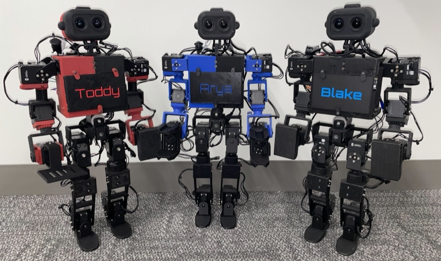

# ToddlerBot

[Catalogo robot](README.md) · [Training compatibile con ArduPilot](training.md) · [README](../../README.it.md)



*ToddlerBot, i tre esemplari Toddy, Arya e Blake del banner del repo (docs/_static/banner.png). Foto: [github.com/hshi74/toddlerbot](https://github.com/hshi74/toddlerbot).*

| | |
|---|---|
| Id (cartella) | `toddlerbot` |
| `NNM_ROBOT` | **16** |
| Classe | bipede |
| Progetto | Stanford (Haochen Shi, C. Karen Liu) |
| Stato | scena MuJoCo nativa pronta; policy da addestrare |
| Giunti comandati | 12 |
| Osservazione | 45 valori |
| Frequenza policy | 50 Hz |
| Attuatori | 30× Dynamixel su bus TTL: anche 2XC430 (pitch+roll), hip yaw e collo/busto XC330, ginocchia e caviglie pitch XM430-W210, caviglie roll e spalle pitch XC430, braccia 2XL430 (variante 2xm: 2XM430-W350 su anche e braccia); kp upstream 2100 gambe, 1500 XC330/XC430, 600 braccia |
| Collegamento | servo su bus seriale: serve il backend bus nel firmware (non ancora scritto) |
| Licenza upstream | MIT (codice e documentazione); CC BY-NC-SA (CAD Onshape, STL) |

## Repo originale e file di base

- Repository: [github.com/hshi74/toddlerbot](https://github.com/hshi74/toddlerbot)
- Scena MuJoCo upstream: [`toddlerbot/descriptions/toddlerbot_2xc/scene_pos.xml`](https://github.com/hshi74/toddlerbot/blob/main/toddlerbot/descriptions/toddlerbot_2xc/scene_pos.xml)
- CAD e parti stampabili: Onshape (link nel README upstream), STL per la stampa su MakerWorld e in toddlerbot/descriptions/toddlerbot_2xc/assets (con URDF toddlerbot_2xc.urdf); manuale di assemblaggio docs/_static/assembly_manual.pdf
- BOM e montaggio: foglio Google pubblicato dalla documentazione (sezione Bill of Materials); PCB TTL power board (docs/_static/TTLPowerBoardV8.zip, ordinabile su JLCPCB); Jetson Orin NX, camere stereo, batteria LiPo; costo dichiarato dal paper nell'ordine dei 6000 USD
- Training upstream: MJX/Brax PPO (toddlerbot/locomotion/train_mjx.py, config gin per skill: walk, crawl, cartwheel, get_up, climb, ...), fisica 5 ms e decimazione 4 (50 Hz), riferimento ZMP con segnale di fase, osservazione 84 (fase 2, comandi 3, 30 posizioni e 30 velocità motore, 12 azioni precedenti, gyro 3, quaternione 4) impilata su 15 frame, critico privilegiato 151; action_scale 0,25; randomizzazione di kp/kd, massa, posa iniziale; deployment zero-shot sul robot (TensorRT su Jetson)
- Policy upstream: checkpoint delle skill su Google Drive (link nel README, sezione Locomotion Beyond Feet): osservazione 84 × 15 frame con quaternione e tutti i 30 motori, non il contratto NNMixer a frame singolo; non convertibile

Per scaricare il repo originale e preparare la scena usata da simulazione e training:

```bash
.venv/bin/python tools/robots/fetch_upstream.py --robot toddlerbot
```

Nota sul modello: MJCF nativo generato da Onshape (onshape_to_robot.py): 30 attuatori, 51 qpos, chiusure cinematiche al collo e tendine di accoppiamento al busto. La variante scene_pos.xml ha attuatori di posizione (kp 14 su anche, ginocchia e caviglie pitch, 10 sugli XC330/XC430, coppia ±10) e nessun sensore IMU: l'ambiente li aggiunge sul body torso. Caricato in nnm_env.py sta in piedi a policy zero (150 passi, inclinazione 2°). I 18 attuatori fuori contratto (braccia, busto, collo) restano a ctrl 0, non sulla posa home: prima del training conviene fondere braccia e busto nel tronco, come il T1_locomotion di Booster, oppure aggiungere all'ambiente il mantenimento della posa.

## Topologia

File: [`robots/toddlerbot/robot/profile.json`](../../robots/toddlerbot/robot/profile.json) → `robot.bin` sulla microSD. Ordine dei giunti = ordine di osservazione, azione e uscite servo.

| # | Giunto | q0 (rad) | Uscita servo |
|---:|---|---:|---|
| 0 | `left_hip_pitch` | -0.0913 | `SERVO1_FUNCTION 94` |
| 1 | `left_hip_roll` | +0.0000 | `SERVO2_FUNCTION 95` |
| 2 | `left_hip_yaw_drive` | +0.0000 | `SERVO3_FUNCTION 96` |
| 3 | `left_knee` | -0.3808 | `SERVO4_FUNCTION 97` |
| 4 | `left_ankle_roll` | +0.0000 | `SERVO5_FUNCTION 98` |
| 5 | `left_ankle_pitch` | -0.2895 | `SERVO6_FUNCTION 99` |
| 6 | `right_hip_pitch` | +0.0913 | `SERVO7_FUNCTION 100` |
| 7 | `right_hip_roll` | +0.0000 | `SERVO8_FUNCTION 101` |
| 8 | `right_hip_yaw_drive` | +0.0000 | `SERVO9_FUNCTION 102` |
| 9 | `right_knee` | +0.3808 | `SERVO10_FUNCTION 103` |
| 10 | `right_ankle_roll` | +0.0000 | `SERVO11_FUNCTION 104` |
| 11 | `right_ankle_pitch` | +0.2895 | `SERVO12_FUNCTION 105` |

Osservazione (45): gyro FLU 3, gravità FLU 3, q−q0 12, q̇ 12, azione precedente 12, twist vx vy ωz 3.
Azione (12): offset in radianti, `q_target = q0 + azione`.

## Architettura PPO

File: [`robots/toddlerbot/robot/ppo.yaml`](../../robots/toddlerbot/robot/ppo.yaml). Stessa rete di MicroDuck, già provata su Pixhawk 6C: **45 → 512 → 256 → 128 → 12**, ELU, normalizzazione dell'osservazione incorporata. Pesi int8 per riga addestrati sulla griglia int8 dalla prima iterazione (QAT), attivazioni float32. PPO: 2048 ambienti × 24 passi, 5 epoche, 4 minibatch, lr 1e-3 adattivo (KL 0,01), γ 0,99, λ 0,95, clip 0,2.

## Policy

Cartella: [`robots/toddlerbot/policies/`](../../robots/toddlerbot/policies/) → sulla microSD `/APM/nnm/toddlerbot/policies/`. `NNM_POLICY` = indice del file in ordine alfabetico.

Nessuna policy ancora: va addestrata (sezione successiva).

## Training compatibile con ArduPilot

L'ambiente è già il deployment: fisica a 200 Hz come il loop dell'autopilota, gravità dal filtro IMU del firmware, azione tagliata a `NNM_ACT_MAX` e codificata in PWM, osservazione nell'ordine del profilo. Dettagli in [training.md](training.md).

```bash
.venv/bin/python tools/robots/nnm_env.py --robot toddlerbot                       # carica la scena, passo a policy zero
.venv/bin/python tools/robots/train_velocity.py --robot toddlerbot --envs 8 --iters 200 --name walk
.venv/bin/python tools/robots/train_velocity.py --robot toddlerbot --eval robots/toddlerbot/policies/walk.nnm
```

Il trainer CPU serve per verifiche e rifiniture brevi. Per una policy completa (2048 ambienti × 2000 iterazioni) si usa mjlab su GPU con gli stessi due pezzi: `deploy_contract.py` per osservazione e azione, `nnm_qat.enable_qat()` sull'actor, `export_nnm_from_actor()` per il file.

## Deploy sull'autopilota

```bash
python tools/robots/pack_robot_bin.py --robot toddlerbot          # robot.bin dal profilo
# microSD: /APM/nnm/toddlerbot/robot.bin  e  /APM/nnm/toddlerbot/policies/*.nnm
```

Parametri: `NNM_ENABLE 1`, `NNM_ROBOT 16` (riavvio), `NNM_POLICY 0`, `SERVO1..12_FUNCTION 94..105`, `INS_GYRO_FILTER 0`, `SCHED_LOOP_RATE 200`.

## Note

- La policy di cammino upstream comanda solo le 12 gambe (`action_parts = ['leg']`) e tiene braccia, busto e collo sulla posa home con i loro PD: il contratto fa lo stesso, 12 giunti e osservazione 45, dentro le 16 funzioni servo Scripting (SITL e HIL funzionano; il robot vero richiede il backend bus).
- L'ordine dei giunti è il `motor_ordering` upstream del gruppo `leg` (hip pitch, hip roll, hip yaw, knee, ankle roll, ankle pitch; sinistra poi destra). `left_hip_yaw_drive` è il motore che muove l'anca attraverso un ingranaggio: come upstream la policy vede l'angolo motore, non quello dell'anca.
- q0 è la posa home di `default.yml` (anca pitch ∓0,091, ginocchio ∓0,381, caviglia pitch ∓0,290 rad, il destro col segno opposto perché i giunti sono specchiati) con il torso a 0,310 m, la stessa del keyframe `home` del MJCF.
- Il MJCF `scene_pos.xml` si carica in `nnm_env.py` così com'è (i 12 giunti del contratto hanno il loro attuatore, osservazione 45) e il robot sta in piedi a policy zero: 150 passi, inclinazione finale 2,1°. I 18 attuatori restanti ricevono però ctrl 0 invece della posa home (spalle yaw ±90°, gomiti piegati): le braccia pendono lungo il corpo. Prima del training va fuso il resto del corpo nel tronco oppure aggiunto all'ambiente il mantenimento della posa per gli attuatori fuori contratto.
- L'osservazione upstream (84 × 15 frame, quaternione, 30 motori) non si converte in .nnm: si riaddestra sul contratto. Il riferimento ZMP con fase e la randomizzazione dei guadagni sono i due pezzi da riportare, come già fatto con il gait clock di Booster.
- Il repo copre anche skill oltre il cammino (crawl, cartwheel, get_up, salita di scatole e scale, `run_multiple_policy.py` con classificatore di skill su profondità stereo): fuori dal contratto velocità, ma riusabili come riferimenti di getup, già presenti per Microban.
