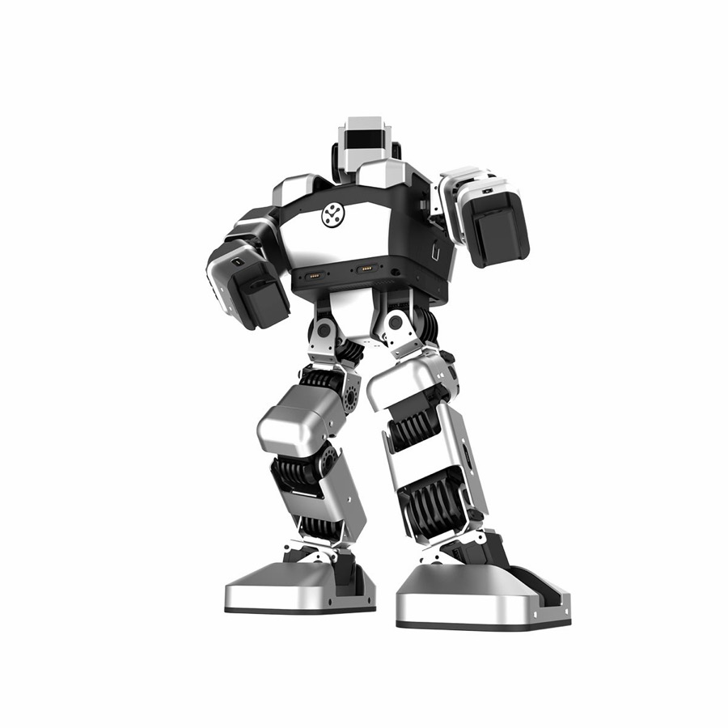

# Yanshee

[Catalogo robot](README.md) · [Training compatibile con ArduPilot](training.md) · [README](../../README.it.md)



*Yanshee, foto prodotto. Foto: [eduk8.gr/en/product/yanshee/](https://eduk8.gr/en/product/yanshee/).*

| | |
|---|---|
| Id (cartella) | `yanshee` |
| `NNM_ROBOT` | **14** |
| Classe | bipede |
| Progetto | UBTECH |
| Stato | manca una scena MuJoCo pronta per il training |
| Giunti comandati | 17 |
| Osservazione | 60 valori |
| Frequenza policy | 50 Hz |
| Attuatori | 17 servo seriali UBTECH ad alta velocità con frizione (9,6 V); il computer di bordo è una Raspberry Pi 3B, non un autopilota |
| Collegamento | servo su bus seriale: serve il backend bus nel firmware (non ancora scritto) |
| Licenza upstream | portale yandev (SDK non versionato su git); URDF di comunità https://github.com/ChancesSon/Yanshee_ROS senza licenza dichiarata |

## Repo originale e file di base

- Repository: [yandev.ubtrobot.com/#/en/](https://yandev.ubtrobot.com/#/en/)
- CAD e parti stampabili: non pubblicato. Il portale yandev è l'interfaccia ufficiale; UBTEDU/Yanshee-SDK e Yanshee-Raspi-SDK su GitHub sono marcati deprecati e rimandano al portale
- BOM e montaggio: manuale FCC del modello ERHA101: [fcc.report/FCC-ID/2AHJX-YANSHEE-1/4483024.pdf](https://fcc.report/FCC-ID/2AHJX-YANSHEE-1/4483024.pdf) (370×192×106 mm, ≈2,05 kg, 17 servo, 9,6 V, Raspberry Pi 3B, IMU 9 assi, camera 8 MP)
- Training upstream: nessuna pipeline RL pubblicata: l'SDK esegue azioni e file di motion già pronti
- Policy upstream: nessuna

Per scaricare il repo originale e preparare la scena usata da simulazione e training:

```bash
.venv/bin/python tools/robots/fetch_upstream.py --robot yanshee
```

Nota sul modello: nessun MJCF. L'unico URDF pubblico (yanshee/urdf/yanshee.urdf, 17 giunti revolute) non ha masse né inerzie: va ricostruito prima del training e salvato come robots/yanshee/robot/scene.xml.

## Topologia

File: [`robots/yanshee/robot/profile.json`](../../robots/yanshee/robot/profile.json) → `robot.bin` sulla microSD. Ordine dei giunti = ordine di osservazione, azione e uscite servo.

| # | Giunto | q0 (rad) | Uscita servo |
|---:|---|---:|---|
| 0 | `head` | +0.0000 | `SERVO1_FUNCTION 94` |
| 1 | `left_arm1` | +0.0000 | `SERVO2_FUNCTION 95` |
| 2 | `left_arm2` | +0.0000 | `SERVO3_FUNCTION 96` |
| 3 | `left_arm3` | +0.0000 | `SERVO4_FUNCTION 97` |
| 4 | `right_arm1` | +0.0000 | `SERVO5_FUNCTION 98` |
| 5 | `right_arm2` | +0.0000 | `SERVO6_FUNCTION 99` |
| 6 | `right_arm3` | +0.0000 | `SERVO7_FUNCTION 100` |
| 7 | `left_leg1` | +0.0000 | `SERVO8_FUNCTION 101` |
| 8 | `left_leg2` | +0.0000 | `SERVO9_FUNCTION 102` |
| 9 | `left_leg3` | +0.0000 | `SERVO10_FUNCTION 103` |
| 10 | `left_leg4` | +0.0000 | `SERVO11_FUNCTION 104` |
| 11 | `left_leg5` | +0.0000 | `SERVO12_FUNCTION 105` |
| 12 | `right_leg1` | +0.0000 | `SERVO13_FUNCTION 106` |
| 13 | `right_leg2` | +0.0000 | `SERVO14_FUNCTION 107` |
| 14 | `right_leg3` | +0.0000 | `SERVO15_FUNCTION 108` |
| 15 | `right_leg4` | +0.0000 | `SERVO16_FUNCTION 109` |
| 16 | `right_leg5` | +0.0000 | oltre Scripting16: serve il backend bus |

Osservazione (60): gyro FLU 3, gravità FLU 3, q−q0 17, q̇ 17, azione precedente 17, twist vx vy ωz 3.
Azione (17): offset in radianti, `q_target = q0 + azione`.

## Architettura PPO

File: [`robots/yanshee/robot/ppo.yaml`](../../robots/yanshee/robot/ppo.yaml). Stessa rete di MicroDuck, già provata su Pixhawk 6C: **60 → 512 → 256 → 128 → 17**, ELU, normalizzazione dell'osservazione incorporata. Pesi int8 per riga addestrati sulla griglia int8 dalla prima iterazione (QAT), attivazioni float32. PPO: 2048 ambienti × 24 passi, 5 epoche, 4 minibatch, lr 1e-3 adattivo (KL 0,01), γ 0,99, λ 0,95, clip 0,2.

## Policy

Cartella: [`robots/yanshee/policies/`](../../robots/yanshee/policies/) → sulla microSD `/APM/nnm/yanshee/policies/`. `NNM_POLICY` = indice del file in ordine alfabetico.

Nessuna policy ancora: va addestrata (sezione successiva).

## Training compatibile con ArduPilot

L'ambiente è già il deployment: fisica a 200 Hz come il loop dell'autopilota, gravità dal filtro IMU del firmware, azione tagliata a `NNM_ACT_MAX` e codificata in PWM, osservazione nell'ordine del profilo. Dettagli in [training.md](training.md).

```bash
.venv/bin/python tools/robots/nnm_env.py --robot yanshee                       # carica la scena, passo a policy zero
.venv/bin/python tools/robots/train_velocity.py --robot yanshee --envs 8 --iters 200 --name walk
.venv/bin/python tools/robots/train_velocity.py --robot yanshee --eval robots/yanshee/policies/walk.nnm
```

Il trainer CPU serve per verifiche e rifiniture brevi. Per una policy completa (2048 ambienti × 2000 iterazioni) si usa mjlab su GPU con gli stessi due pezzi: `deploy_contract.py` per osservazione e azione, `nnm_qat.enable_qat()` sull'actor, `export_nnm_from_actor()` per il file.

## Deploy sull'autopilota

```bash
python tools/robots/pack_robot_bin.py --robot yanshee          # robot.bin dal profilo
# microSD: /APM/nnm/yanshee/robot.bin  e  /APM/nnm/yanshee/policies/*.nnm
```

Con 17 giunti il firmware carica `robot.bin` e le policy (fino a 20 giunti, `NNM_MAX_JOINTS`) e gira in SITL, ma le uscite PWM coprono al massimo 16 funzioni servo Scripting: il deploy sul robot richiede il backend bus. Simulazione, training e file `.nnm` sono già pronti.

## Note

- Il portale [yandev.ubtrobot.com](https://yandev.ubtrobot.com/#/en/) documenta Yanshee, l'umanoide didattico da 37 cm, non Walker. L'HTML del sito non contiene il modello: è un'applicazione web, e l'SDK C/Python che c'era su GitHub è deprecato.
- 17 giunti stanno sotto `NNM_MAX_JOINTS` 20 (osservazione 60). I nomi sono quelli dell'URDF di comunità (`head`, `left_arm1..3`, `left_leg1..5` e destri): non è scritto quale asse sia yaw, roll o pitch, e q0 = 0 è la posa CAD, non una stance misurata. `home_z` 0,20 m è una stima del bacino (il robot è alto 370 mm), da rileggere sul MJCF.
- Sul robot vero il controllo passa dall'SDK sulla Raspberry Pi (azioni, motion, servo), non dalle uscite PWM di un Pixhawk. Un backend bus nel firmware avrebbe senso solo dopo il protocollo dei servo, che nel repo deprecato non è più mantenuto.
- Per la locomozione di un umanoide a grandezza umana UBTECH pubblica altro, ed è quello che conviene usare: TienKung-Lab (voce `tienkung`, BSD-3, MuJoCo e policy di cammino) e, a parte, il modello Walker S2 (URDF/USD sotto OpenAtom Open Hardware License nel repo UBTECH-Robot/WalkerS2-Model, modello ufficiale della Global Humanoid Robot Challenge 2026). L'SDK di movimento del Walker S2 non è pubblico (UBTECH lo manda su richiesta) e la baseline della challenge è imitazione delle braccia in Isaac Sim (ACT e Pi0, LeRobot), non una policy di cammino.
